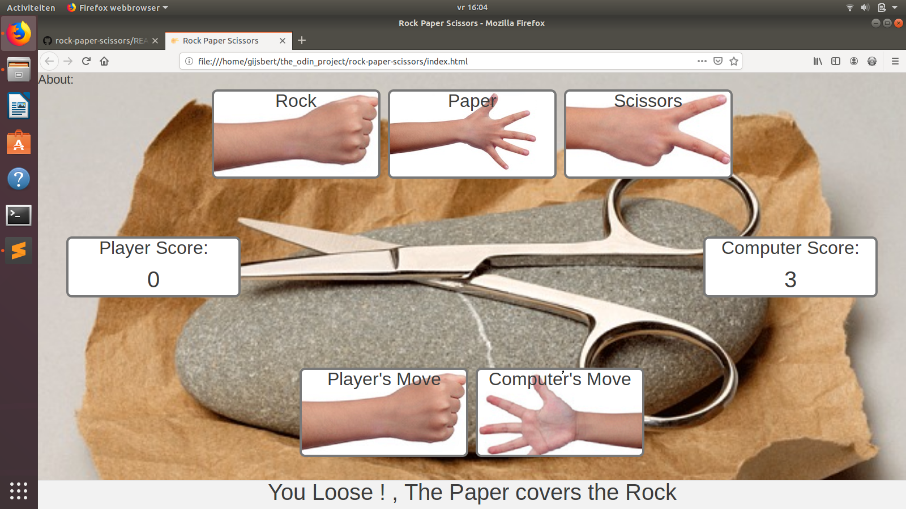

<h1>Rock Paper Scissors</h1>

<h2>Rules of the game.</h2>

You are playing aganst the computer and the player/computer achieving a score of 5 points is the winner. 
   The player starts a round by choosing the hand-symbol for Rock, Paper or Scissors, the computer will make a move too. 
 Points will be given by the rules in the following list.

<ul>
<li>Rock vs Scissors: The player who played Rock gets 1 point, because a rock will blunts a scissor.</li>
<li>Paper vs Rock : The player who played Paper gets 1 point, because a paper will cover a rock.</li>
<li>Scissors vs Paper: The player who played Paper gets 1 point, because a paper will cover a rock.</li>
<li>Paper vs Paper: (as an example of the same choice) Let's call it a draw, neither player nor computer gets a point.</li>
</ul>

<h2>This is how it looks.</h2>

<h2>Another level</h2>

At another level,this game is a study case of 
 <a href="https://www.theodinproject.com/courses/web-development-101">"The Odin Project" course in web-development 101.></a>

I can highly recommend this course because it gives me all the freedom to show my creativity.
 

<h2>Some more ....</h2>

I looked in the kitchen of some other developer's and there were program's I couldn't read at all. Other program's were very basic, still there was nothing out there worth of copying. That's why I started from scrap and with a lot, a lot of try and errors, I understood some of the basics in developing websites. Hence I'm satisfied with this product for the moment.
    

When you know that the computer plays 100 % random (random is not entirely random, like a dice, but for this game it complies), it makes the game very booring.

Possible improvements to this program could be:
<ul>
<li>Make a DUMB mode: Computer Choices are fully random. (like now)</li>
<li>Make a SMART mode: Computer Choice depends on psychological rules. (based on human preferences and behaviour)</li>
<li>Make a Log-in: Computer can act on databased choices of a certain person. </li>
<li>Make a CHEAT mode: Computer still acts random on certain moves but with knowledge of player's choice.(with propability percentage)</li>
</ul>

<h2> Happy Programming ..... </h2>